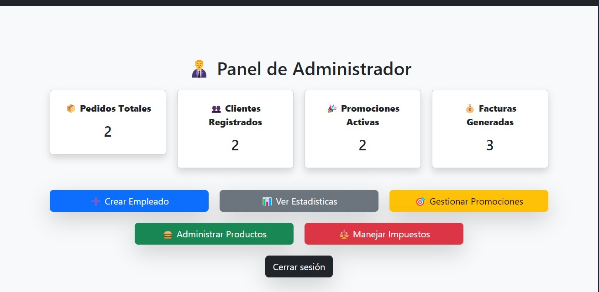

# ProyectoFinalSegundo

# API Menuboard
Para el proyecto, se decidió usar dos APIs públicas, las cuales son:

# PokéAPI
Esta API gratuita proporciona información sobre el universo de Pokémon y permite acceder a diversos datos del mismo.
El propósito de utilizar esta API en el proyecto es generar Pokémon aleatorios, los cuales estarán asociados a un producto llamado Cajita Feliz.
Con la compra de una Cajita Feliz, se entregará un Pokémon aleatorio, lo que hace que el producto sea más atractivo para los clientes.

Sus funcionalidades principales son: 

- Obtener información de cualquier Pokémon por nombre o ID. 

- Generar un Pokémon aleatorio a partir del total disponible en la API.

Requisitos: 

- No requiere autenticación con API Key, por lo que cualquier usuario puede hacer solicitudes.

- Usa el formato JSON para las respuestas.

- Se accede mediante métodos HTTP GET.

Limitaciones: 

- Límite de 100 solicitudes por minuto en la versión gratuita.

- No tiene datos sobre los Pokémon de última generación de forma inmediata tras su lanzamiento.

- No ofrece imágenes de alta resolución, solo sprites oficiales.

 
 

# OpenWeatherMap
Este es un servicio que proporciona datos meteorológicos en tiempo real y suele utilizarse en aplicaciones web y móviles para obtener información climática.
La API es gratuita, aunque también cuenta con una versión de pago.

Sus funcionalidades principales son: 

- Obtener el clima actual de cualquier ciudad por nombre o coordenadas.

Acceder a datos como:

    - Temperatura, humedad y presión atmosférica.

    - Velocidad y dirección del viento.

    - Condiciones meteorológicas (lluvia, nieve, nubes, etc.).

    - Hora de salida y puesta del sol.

- Consultar pronósticos de hasta 16 días.

- Alertas meteorológicas para eventos extremos.

Requisitos: 

- Se requiere una API Key (se obtiene registrándose en OpenWeatherMap).

- Las respuestas se entregan en formato JSON.

- Uso de métodos HTTP GET para las solicitudes.

Limitaciones: 

- En la versión gratuita: 

    - Se permite un máximo de 60 solicitudes por minuto.
  
    - No incluye datos avanzados como calidad del aire o información histórica.
  
    - El acceso a datos de clima en alta resolución está limitado a los planes pagos.

- En ocasiones, la información del clima puede tener un retraso de 5 a 10 minutos.

El propósito de integrarla al proyecto es ofrecer promociones basadas en el clima actual.
Por ejemplo:

- Si el clima es lluvioso, se ofrecerán descuentos en comidas calientes.

- Si el día es caluroso, se ofrecerán descuentos en helados o bebidas frías. 

 

# GUI, Base de Datos y API

## Descripción General
Esta aplicación integra una Interfaz Gráfica de Usuario (GUI), una base de datos con operaciones CRUD y la integración de una API o librería externa. El objetivo es proporcionar una experiencia de usuario intuitiva y funcional, garantizando la conectividad con el backend y la base de datos, así como la ampliación de funcionalidades mediante APIs o librerías.

---
# Implementación de la Interfaz Gráfica de Usuario (GUI)

## Descripción
La GUI ha sido diseñada para permitir a los usuarios interactuar de manera sencilla con la aplicación. Se han aplicado principios de UX/UI para garantizar una navegación fluida y una experiencia intuitiva. La interfaz debe ser visualmente atractiva y estructurada de manera lógica para facilitar su uso.

## Características
- Implementación de formularios para la entrada de datos.
- Botones de acción para realizar operaciones CRUD.
- Menús de navegación intuitivos para acceder a distintas funcionalidades.
- Validación de entradas del usuario para evitar errores y mejorar la experiencia.
- Implementación de diseño responsivo para diferentes tamaños de pantalla.

## Criterios de Evaluación
- **Diseño adecuado:** La interfaz es intuitiva, bien organizada y con un diseño atractivo.
- **Conectividad con el backend:** Permite la comunicación con las clases implementadas previamente.
- **Funcionalidad completa:** Soporte para CRUD (Crear, Leer, Actualizar, Eliminar).
- **Calidad estética y usabilidad:** La interfaz sigue buenas prácticas de UX/UI, asegurando que el usuario pueda utilizarla sin dificultades.

---
# Integración con una Base de Datos y Operaciones CRUD

## Descripción
La aplicación está conectada a una base de datos que permite gestionar la información mediante operaciones CRUD. La integración se realiza mediante consultas seguras para garantizar la consistencia y seguridad de los datos.

## Características
- Configuración de base de datos: SQLite
- Creación y gestión de tablas necesarias para la aplicación.
- Implementación de consultas parametrizadas para evitar inyección SQL.
- Manejo de errores y transacciones para garantizar la integridad de los datos.
- Conexión eficiente con la GUI para visualizar y modificar la información.

## Criterios de Evaluación
- **Configuración correcta de la base de datos:** Definición adecuada de tablas y relaciones.
- **Funcionalidad CRUD:** La interfaz permite realizar todas las operaciones de gestión de datos.
- **Seguridad:** Implementación de medidas de protección, como autenticación y autorización para evitar accesos no autorizados.
- **Eficiencia:** Consultas optimizadas para garantizar tiempos de respuesta rápidos.

---
# Uso de APIs o Librerías Estándar

## Descripción
Se ha integrado una API externa o una librería estándar para mejorar las funcionalidades de la aplicación. Esto permite extender las capacidades de la aplicación sin necesidad de desarrollar todas las funciones desde cero.

## Características
- Implementación de una API de terceros (clima, geolocalización, conversión de moneda, etc.).
- Integración con módulos desarrollados por otros grupos para ampliar funcionalidades.
- Documentación detallada sobre el uso de la API dentro del proyecto.
- Manejo de errores y optimización de llamadas a la API para evitar tiempos de respuesta largos.

## Criterios de Evaluación
- **Integración correcta de la API o librería:** Mejora la funcionalidad sin afectar el rendimiento ni la estabilidad.
- **Claridad en la documentación:** Explicación detallada sobre el uso de la API, incluyendo ejemplos de código.
- **Eficiencia:** La API o librería es utilizada de manera eficiente, evitando cargas innecesarias en la aplicación.
- **Manejo de errores:** Implementación de validaciones para prevenir fallos en caso de errores en la API.

# Capturas realizadas del proyecto

